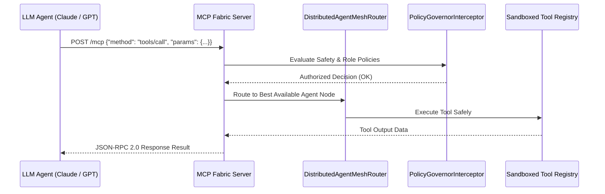

# Model Context Protocol (MCP) Autonomous Agent Fabric 👑 🤖

<div align="center">

[](https://opensource.org/licenses/MIT)
[](https://www.typescriptlang.org/)
[](https://modelcontextprotocol.io)
[](https://github.com/anderdebona/mcp-autonomous-agent-fabric)
[](https://github.com/anderdebona/mcp-autonomous-agent-fabric/actions)

<br />

**Production-Grade Model Context Protocol Server, Multi-Agent Mesh Router & Policy Governor Fabric**

*Engineered by **[anderdebona](https://github.com/anderdebona)***

</div>

---

## 📌 Abstract & Industry Impact

The **Model Context Protocol (MCP)**, initiated by **Anthropic**, is the universal standard connecting Large Language Models (LLMs) to tools, databases, and enterprise data sources securely.

The **`mcp-autonomous-agent-fabric`** is a production-ready **MCP Server & Agent Interoperability Governance Fabric** featuring:
1. **Full JSON-RPC 2.0 MCP Protocol Specification** (`tools/list`, `tools/call`, `resources/read`).
2. **DistributedAgentMeshRouter**: Capability-aware multi-agent task dispatching and load-balancing.
3. **PolicyGovernorInterceptor**: AST pattern checking, SQL injection sandboxing, and security audit log generation.
4. **Session Management & EventBus**: Real-time broadcast and lifecycle tracing.

---

## 🏛️ System Architecture & Message Flow



---

## ⚡ What's New in v4.0.0

- 🌐 **`DistributedAgentMeshRouter`**: Dynamic peer agent node discovery, latency-aware and least-busy routing strategies.
- 🛡️ **`PolicyGovernorInterceptor`**: Pre-execution security barrier preventing unauthorized database mutation and script execution.
- 📢 **`MCPEventBus` & `ResourceProvider`**: Publish/Subscribe event streams and dynamic URI resource resolution.
- 🐙 **Automated CI/CD Workflows**: Multi-node matrix pipelines for seamless testing.

---

## 🚀 Quickstart & Installation

```bash
# Clone repository
git clone https://github.com/anderdebona/mcp-autonomous-agent-fabric.git
cd mcp-autonomous-agent-fabric

# Install dependencies
npm install

# Run automated tests
npm test

# Build & Run MCP Server & Inspector
npm run dev
```

Visit the interactive MCP Inspector Dashboard at: **`http://localhost:3008`**

---

## 🌟 Join the Community & Contribute

We are actively building the open standard for autonomous multi-agent interoperability:
1. ⭐ **Star this repository** to support open-source agent governance.
2. 🗺️ View upcoming milestones in [ROADMAP.md](./ROADMAP.md).
3. 💬 Propose tools or agent schemas via [GitHub Issues](https://github.com/anderdebona/mcp-autonomous-agent-fabric/issues).
4. 📜 Academic citation: see [CITATION.cff](./CITATION.cff).

---

<div align="center">

Distributed under the MIT License. Built with passion by **[anderdebona](https://github.com/anderdebona)**.

</div>
