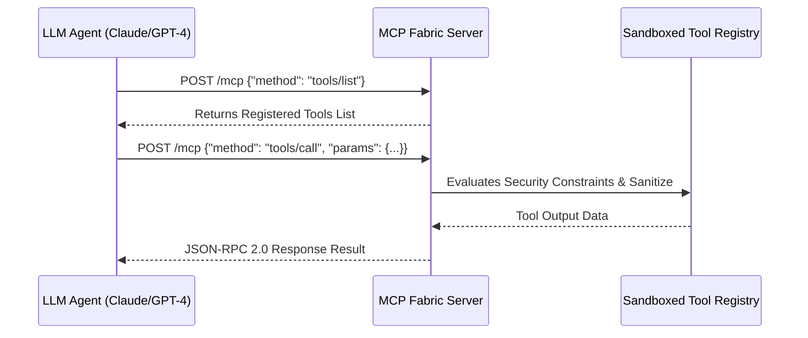

# Model Context Protocol (MCP) Autonomous Agent Fabric 👑 🤖

[](https://opensource.org/licenses/MIT)
[](https://www.typescriptlang.org/)
[](https://modelcontextprotocol.io)

**Author:** anderdebona

---

## 📌 Abstract & Industry Impact

The **Model Context Protocol (MCP)**, open-sourced by **Anthropic**, is the universal standard connecting Large Language Models (LLMs) to tools, databases, and enterprise data sources securely.

The **`mcp-autonomous-agent-fabric`** is a production-ready **MCP Server & Agent Interoperability Governance Fabric** featuring:
1. **Full JSON-RPC 2.0 MCP Protocol Specification** (`tools/list`, `tools/call`, `resources/read`).
2. **Tool Execution Sandboxing** (enforcing read-only constraints and preventing prompt injection / malicious SQL executions).
3. **Web Observability Inspector Dashboard**.
4. **Automated Vitest Test Suite**.

---

## 🏛️ System Architecture & Message Flow



---

## 🚀 Quickstart & Installation

```bash
# Clone repository
git clone https://github.com/anderdebona/mcp-autonomous-agent-fabric.git
cd mcp-autonomous-agent-fabric

# Install dependencies
npm install

# Build & Run MCP Server & Inspector
npm run dev
```

Visit the interactive MCP Inspector Dashboard at: **`http://localhost:3008`**

---

## 🧪 Automated Unit Testing

```bash
npm test
```

---

## 📜 Citation & License

```bibtex
@software{anderdebona2026mcp,
  author = {anderdebona},
  title = {Model Context Protocol (MCP) Autonomous Agent Fabric},
  year = {2026},
  publisher = {GitHub},
  journal = {GitHub Repository},
  howpublished = {\url{https://github.com/anderdebona/mcp-autonomous-agent-fabric}}
}
```

Licensed under the MIT License.
